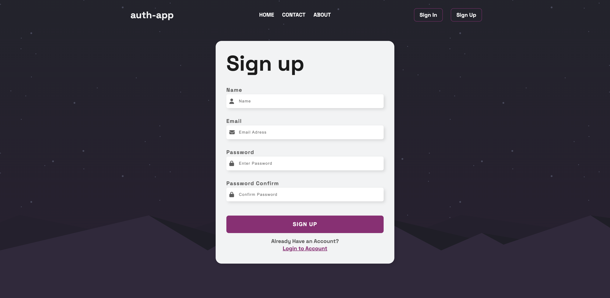

# Auth App - Frontend

## 📌 Descrizione

**Auth App** è un'applicazione frontend sviluppata con **Vue 3** e **Vite**, progettata per dimostrare le mie capacità di sviluppo. L'app include le seguenti funzionalità:

- 🔑 Registrazione utente
- 🔓 Login e Logout
- 🔄 Recupero password e aggiornamento password
- 🗑️ Cancellazione account con soft delete
- ✅ Validazione avanzata dei form
- 📱 **Design responsive mobile-first** per garantire una buona esperienza utente su dispositivi mobili e desktop.
- 🎨 Massima attenzione all'UX

## 🛠️ Tecnologie Utilizzate

- **Vue 3** + **Vite**
- **Pinia** (per la gestione dello stato)
- **Session Storage** (per la gestione della sessione utente)
- **Vue Router** (per la gestione delle rotte)
- **Axios** (per le chiamate API)
- **CSS** (per lo stile e l'esperienza utente)

## 📸 Screenshot

## 🔗 Link al Progetto

[**Demo Online**](https://thomas-mach.github.io/auth-app-frontend/)
